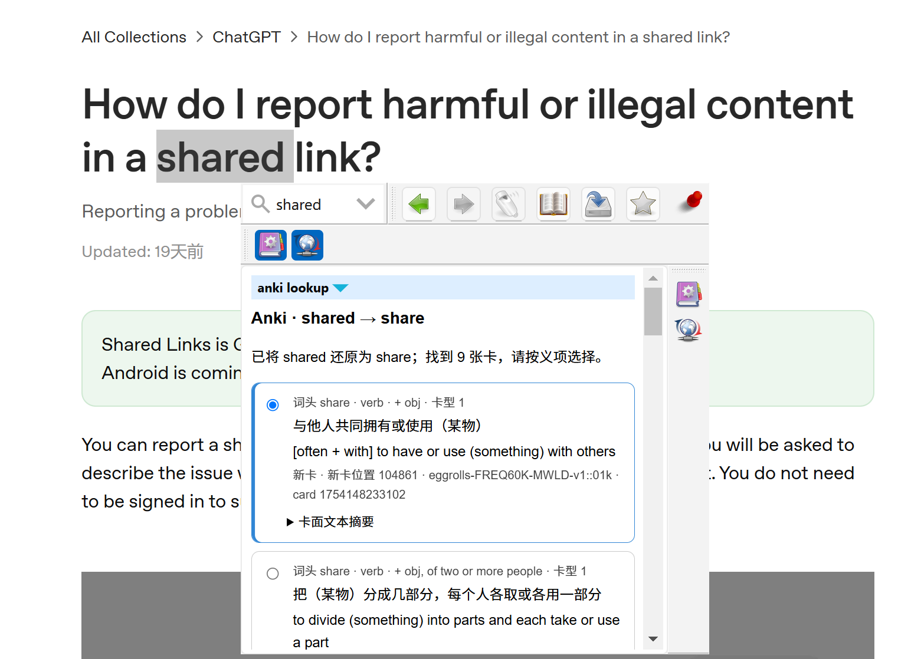
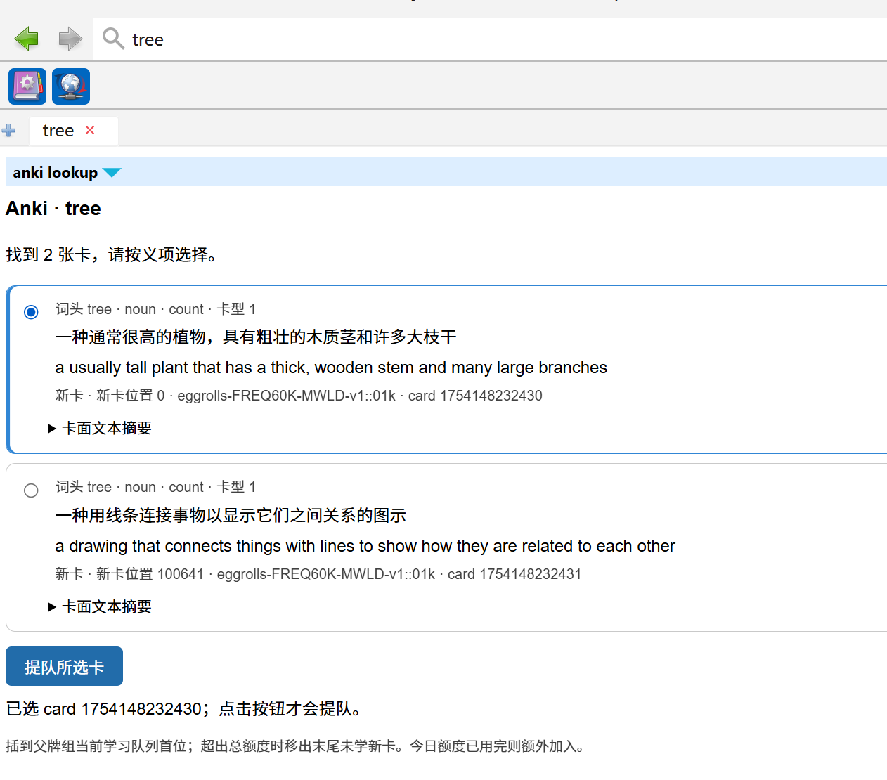
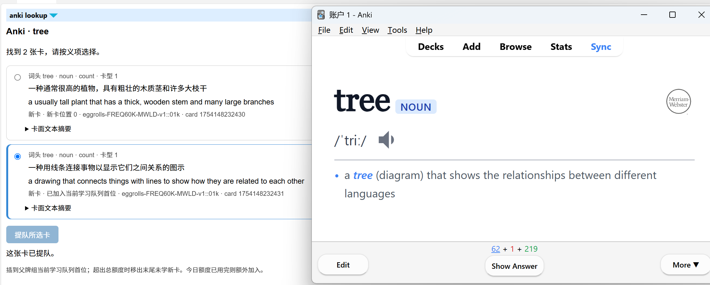

# goldendict-anki-recaller

> 查到一个词，召回牌组里已有的卡。

`goldendict-anki-recaller` 是一个针对 [GoldenDict-ng](https://github.com/xiaoyifang/goldendict-ng) 与 [Anki](https://apps.ankiweb.net/) 的联动插件，通过 [AnkiConnect](https://github.com/FooSoft/anki-connect) 查询牌组并执行提队。

**Recaller** 表示把已经存在于完整牌组中的卡片召回到眼前：在 GoldenDict-ng 查词时找到对应卡片，并把它送入 Anki 当前学习队列。

这个项目面向已经拥有完整预制牌组的学习者。阅读时在 GoldenDict 查到一个词，程序会在现有牌组中检索对应卡片，列出不同义项供选择，再把当前语境对应的卡片放到 Anki 当天学习队列首位。

GoldenDict 已有查词后制作并添加 Anki 卡片的方案；本项目解决的是另一种流程：**不制卡、不创建笔记、不向牌组添加重复内容**，只决定完整牌组中的哪张已有卡片应当优先学习。只有点击「提队所选卡」才会改变当天的学习计划。

它尤其适合按词频划分子牌组、为各子牌组设置不同新卡限额，并在父牌组统一控制每日总量的牌组结构。在这里，“新卡”是 Anki 对尚未学习卡片的状态名称，不表示本项目新建了卡片。

## 演示

### 阅读中查词与词形还原(当前只支持英语)

支持常见复数、时态和不规则词形，如 `shared → share`。同时查找输入词头与原形，保留歧义词的选择空间。



### 按义项选卡

每张卡显示词头、词性、释义和学习状态；默认选中第一张，可切换其他义项或展开卡面文本摘要。



### 将已有卡片插入当前学习队列

选中关系图义项并点击提队后，Anki 立即显示对应卡片。



截图中的牌组和词典内容仅作演示。项目不包含词库或 Anki 牌组，也不依赖特定词库。

## 相关项目

- [GoldenDict-ng](https://github.com/xiaoyifang/goldendict-ng)：提供阅读时的查词界面并运行本项目的 HTML Program。
- [Anki](https://apps.ankiweb.net/)：保存完整牌组并执行间隔重复学习。
- [AnkiConnect](https://github.com/FooSoft/anki-connect)：在 GoldenDict-ng 查询端与 Anki 插件之间提供本机 HTTP API。

## 功能

- 只查询牌组中的已有卡片，不制作或添加卡片。
- 按义项选择目标卡片；支持中英文释义及多卡型摘要。
- 使用 Simplemma 离线还原英语词形，无需下载模型或连接远程服务。
- 将指定新卡放到当前父牌组学习队列首位，包括来自新卡限额为 0 的子牌组。
- 保留原来随机选出的普通新卡；超出父牌组额度时移出末尾未学新卡。
- 今日新卡额度已用完时，将指定卡作为额外学习加入。
- 暂停卡需明确授权解除暂停；支持请求失败提示与重复提交保护。

## 环境

| 组件 | 要求 / 验证情况 |
| --- | --- |
| Python | 3.10+；查词脚本在 Windows / Python 3.14 验证 |
| uv | 管理 Python、虚拟环境与锁定依赖；安装方法见 [uv 官方文档](https://docs.astral.sh/uv/getting-started/installation/) |
| GoldenDict | GoldenDict-ng，需支持词条内 JavaScript；旧版 WebKit 未验证 |
| Anki | 桌面版 V3 调度器；队列逻辑在 Anki 26.8.1 / Python 3.13 验证 |
| AnkiConnect | 已安装并启用，默认监听 `127.0.0.1:8765` |
| Node.js | 仅开发交互测试需要；已在 Node.js 24 验证 |

队列适配使用 Anki 内部接口，其他版本及修改调度器的插件组合需要验证。学习计划只在本机插件启用时生效，不同步到手机。

## 快速开始

### 1. 安装查词脚本

下载或克隆项目到固定目录，例如 `C:\Tools\goldendict-anki-recaller`。在该目录运行：

```powershell
uv sync --frozen
Copy-Item config.example.json config.json
```

`uv sync --frozen` 会按照 `uv.lock` 创建 `.venv` 并安装完全一致的依赖版本。已有 `config.json` 时保留原文件；依赖安装完成后，查词过程不需要联网。

### 2. 配置牌组与字段

修改 `config.json`：

```json
{
  "url": "http://127.0.0.1:8765",
  "deck": "English",
  "field": "Word",
  "sense_fields": ["DefinitionTR", "Definition"],
  "label_fields": ["PoS", "Label"],
  "lemmatize": true,
  "case_sensitive": false,
  "timeout": 10,
  "api_key": null
}
```

将 `deck` 改为实际学习的父牌组，`field` 改为词头字段；释义与标签字段按笔记类型调整。缺失的释义字段会被跳过。`deck: null` 可查询整个集合，但插队建议显式指定父牌组。字段名区分大小写。

通过只读命令检查连接：

```powershell
uv run --frozen python anki_recall.py --inspect --format text
uv run --frozen python anki_recall.py --format text -- trees
```

### 3. 安装 Anki 插件

先安装并启用 [AnkiConnect](https://ankiweb.net/shared/info/2055492159)。在它的配置中保留其他选项，将允许来源设为：

```json
"webCorsOriginList": ["http://localhost", "gdlookup://localhost"]
```

生成本项目插件包：

```powershell
uv run --frozen python scripts/build_release.py
```

在 Anki「工具 → 插件 → 从文件安装」选择 `dist/goldendict-anki-recaller.ankiaddon`，然后重启 Anki。下载的源码发布包已包含该插件包，可直接安装。

如果 AnkiConnect 配置了 API key，请在本项目 `api_key` 或环境变量 `ANKICONNECT_API_KEY` 中设置相同值。不要提交本地配置或分享含密钥的生成页面。

### 4. 接入 GoldenDict

「编辑 → 词典 → 来源 → 程序 / Programs」新增一项，类型选择 **HTML**。先运行一次 `uv sync --frozen`，再将下面的项目路径替换成实际位置：

```text
"C:\Tools\goldendict-anki-recaller\.venv\Scripts\python.exe" "C:\Tools\goldendict-anki-recaller\anki_recall.py" -- "%GDWORD%"
```

也可省略词参数，使用 `--stdin` 从标准输入读取查询词。将该程序词典加入正在使用的词典组。

### 5. 查词并插队

1. 在 Anki 选择配置中的父牌组，保持 Anki 打开。
2. 在 GoldenDict 查词；有结果时默认选中第一张卡。
3. 按当前语境选择义项，点击「提队所选卡」。默认选中本身不会执行提队。
4. 返回 Anki 继续学习。成功后所选卡立即显示在学习界面。

## 学习队列规则

| 情况 | 行为 |
| --- | --- |
| 所选卡已在当天计划中 | 移到首位，不重复占用名额 |
| 插入后超过父牌组每日新卡额度 | 移出末尾未学新卡，卡片仍留在原牌组 |
| 今天已学新卡数达到或超过额度 | 额外加入所选卡 |
| 子牌组新卡额度为 0 | 用户明确选中的新卡仍可加入 |
| 学习中、复习、埋藏或筛选牌组中的卡 | 不执行插队 |

限额指**每日新卡数**，不包含复习卡或学习步骤次数。当天新卡计划按集合保存，重启后可继续，跨学习日恢复原生收集。牌组列表的蓝色数字仍使用原生统计，实际待学数以学习界面为准。更多行为与限制见 [详细说明](docs/behavior.md)。

## 常见问题

**查不到变形词？** 默认 `lemmatize: true`。多词短语和非英语输入只做精确查询；词形库不使用上下文，歧义需按词头和义项选择。`--full-scan` 可排查特殊 HTML 或异常空白，但大型牌组会更慢。

**提示 CORS 或 Failed to fetch？** 确认 Anki 打开，并已加入 `gdlookup://localhost` 来源。部分 GoldenDict-ng 版本会改写 POST 的 Origin，本插件包含针对桥接请求的兼容处理。仍失败时查看 GoldenDict F12 → Console 的错误。

**为什么提示成功却蓝色数字没增加？** 保持总额度的替换不会增加待学新卡总数；牌组列表也不保证反映本机当天计划。

**更新后是否需要重装插件？** 改动 `addon/` 时需重新打包、安装并重启 Anki。仅改查词代码、模板或样式，重新查词即可。`pyproject.toml` 或 `uv.lock` 变化后重新运行 `uv sync --frozen`。

## 项目结构

```text
anki_recall.py                 # GoldenDict Program 启动入口
goldendict_anki/                # 查询、词形还原、HTML 渲染
  templates/                   # Jinja2 模板
  static/                      # CSS 与 JavaScript
addon/                         # AnkiConnect action 与队列插件
tests/                         # 单元、网页交互、真实引擎集成测试
scripts/build_release.py       # 生成插件与干净的源码发布包
docs/images/                   # 三张使用演示截图
config.example.json            # 可提交的配置示例
config.json                    # 本机配置，Git 忽略
pyproject.toml                 # 项目元数据与直接依赖
uv.lock                        # uv 生成的完整依赖锁
.venv/                         # uv 创建的本机环境，Git 忽略
dist/                          # 打包产物，Git 忽略
```

开发与测试命令见 [CONTRIBUTING.md](CONTRIBUTING.md)。打包脚本使用文件允许列表，不将本地配置、依赖、预览或学习数据装入发布包。
